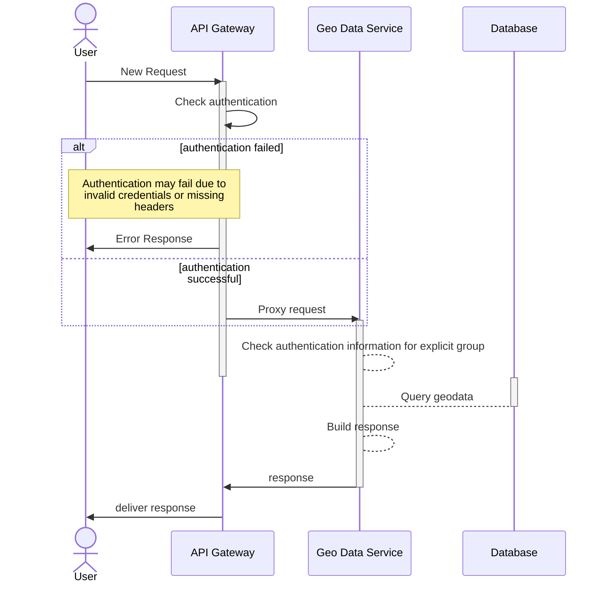

# WISdoM OSS - Consumer Management Service

## Overview
This microservice is responsible for managing consumers and their associated
data.
It is a part of the WISdoM OSS project.
It uses the microservice template for the WISdoM OSS project.

## Using the service
The service is included in every WISdoM OSS deployment by default and does not
require the user to do anything.

A documentation for the API can be found in the [openapi.yaml](openapi.yaml) file in the
repository.

## Request Flow
The following diagram shows the request flow of the service.

## Development
### Prerequisites
- Go 1.20

### Important notices
- Since the service is usually deployed behind an API gateway which
  authenticates the user, the service does reject all requests which do not
  contain the `X-Authenticated-Groups` and `X-Authenticated-User` header.

  You need to set those headers manually when testing the service locally.